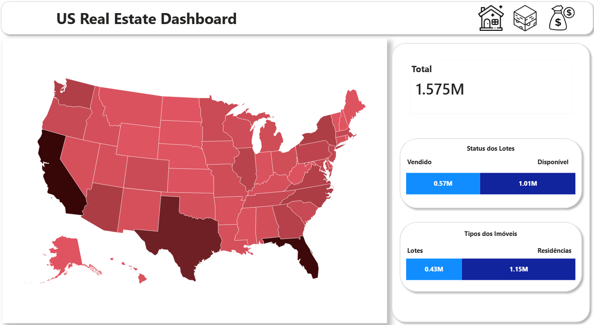
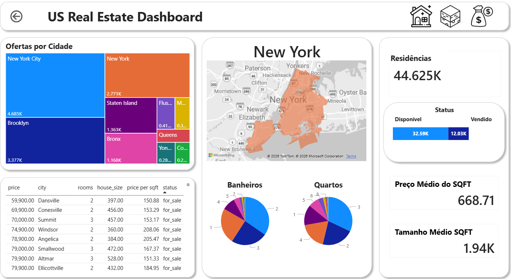
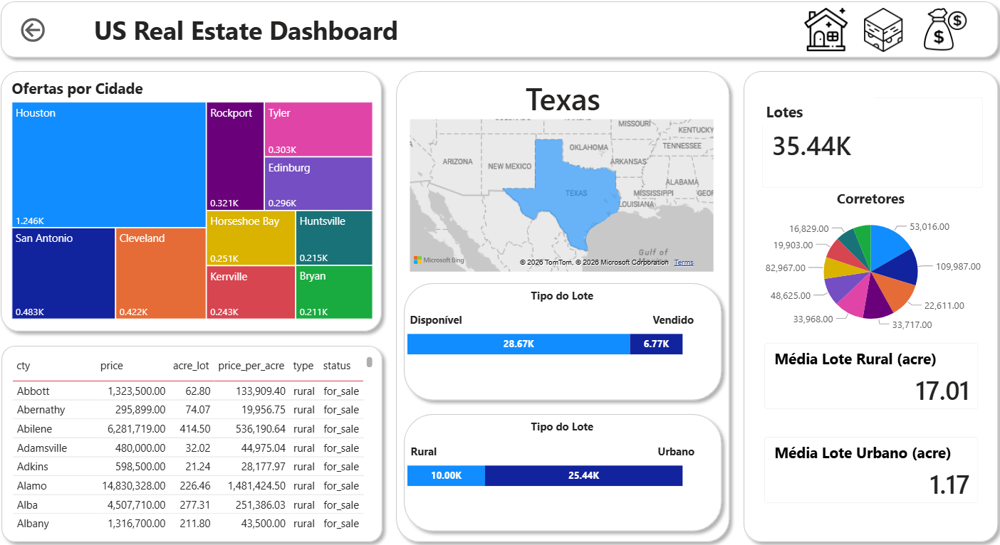
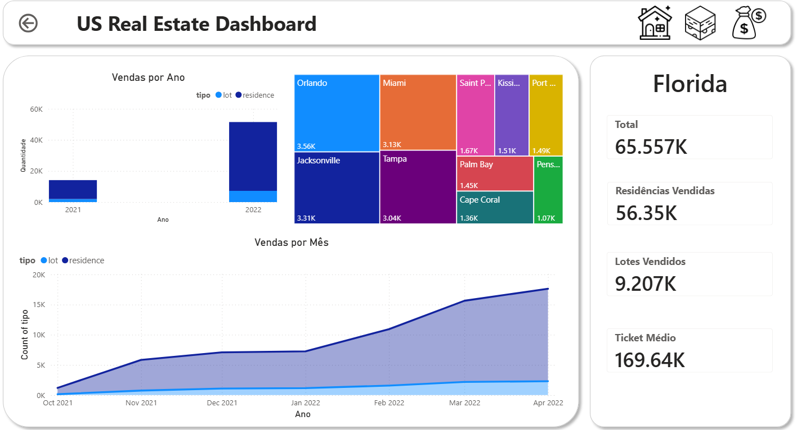

# US Real Estate ETL Visualization

Projeto completo de engenharia e análise de dados utilizando dados do mercado imobiliário dos Estados Unidos. Este projeto cobre todo o pipeline de dados — desde ingestão até visualização — aplicando boas práticas como arquitetura Medalhão e modelagem em Star Schema.






---

## Objetivo

O objetivo deste projeto é analisar uma base de dados pública do Kaggle contendo informações sobre compra, venda e aluguel de imóveis e terrenos nos EUA, transformando os dados em insights relevantes através de um pipeline robusto de ETL e visualização no Power BI.

Dados obtidos a partir de um dataset publico disponibilizado pelo Kaggle: [USA Real Estate Dataset](https://www.kaggle.com/datasets/ahmedshahriarsakib/usa-real-estate-dataset/data)

---

## Tecnologias Utilizadas

* Python
* PySpark
* Pandas
* PostgreSQL
* Psycopg2
* Docker / Docker Compose
* Jupyter Notebook
* Power BI

---

## Arquitetura do Projeto

O projeto segue duas principais abordagens de organização de dados:

### Arquitetura Medalhão (Medallion Architecture)

* **Raw (Bronze)**: Dados brutos, sem tratamento
* **Silver**: Dados limpos e transformados
* **Gold**: Dados modelados para análise

### Modelagem de Dados

* **Star Schema** para otimização de consultas analíticas

---

## Estrutura do Repositório

```
REAL-ESTATE-ETL-VIZUALIZATION
│   .env
│   .gitignore
│   docker-compose.yml
│   README.md
│   requirements.txt
│
├── Data Layer
│   ├── gold
│   │   ├── consultas.sql
│   │   ├── ddl.sql
│   │   ├── mer_der_dld.pdf
│   │   ├── mnemonico.pdf
│   │
│   ├── raw
│   │   ├── analytcs.ipynb
│   │   ├── dicionario_de_dados.pdf
│   │   ├── us-realestate-data.csv
│   │   ├── us-realestate-data.zip
│   │
│   ├── silver
│       ├── analytcs.ipynb
│       ├── ddl.sql
│       ├── mer_der_dld.pdf
│
└── Transformer
    ├── etl_raw_to_silver.ipynb
    ├── etl_silver_to_gold.ipynb
```

---

## Pipeline de Dados

1. **Ingestão (Raw)**

   * Dados importados diretamente do Kaggle
   * Nenhuma transformação aplicada

2. **Transformação (Silver)**

   * Limpeza de dados
   * Tratamento de valores nulos
   * Padronização

3. **Modelagem (Gold)**

   * Aplicação de Star Schema
   * Criação de tabelas fato e dimensão
   * Otimização para consultas analíticas

4. **Visualização**

   * Dashboard desenvolvido no Power BI
   * Insights sobre preços, localização, tendências e mercado imobiliário

---

## Como Executar o Projeto

### 1. Subir o banco de dados com Docker

```bash
docker-compose up -d
```

---

### 2. Criar e ativar ambiente virtual

```bash
python -m venv env
```

#### Linux / Mac:

```bash
source env/bin/activate
```

#### Windows:

```bash
env\Scripts\activate
```

---

### 3. Instalar dependências

```bash
pip install -r requirements.txt
```

---

### 4. Configurar o ambiente para Jupyter

É necessário transformar a venv em um kernel do Jupyter:

```bash
python -m ipykernel install --user --name=venv
```

---

### 5. Executar os notebooks

Ordem recomendada:

1. `Transformer/etl_raw_to_silver.ipynb`
2. `Transformer/etl_silver_to_gold.ipynb`
3. Análises em:

   * `Data Layer/raw/analytcs.ipynb`
   * `Data Layer/silver/analytcs.ipynb`

---

## Resultados

O projeto permite explorar insights como:

* Distribuição de preços por estado
* Tendências de mercado
* Relação entre localização e valor do imóvel
* Tipos de propriedades mais comuns

Os dados finais foram consumidos pelo Power BI para criação de dashboards interativos.

---
